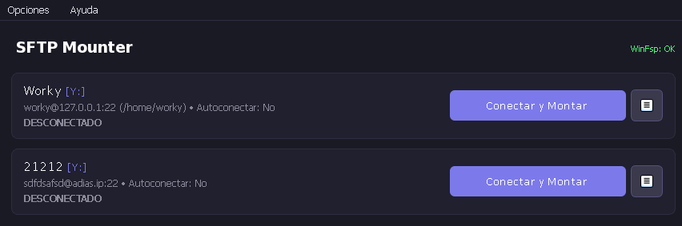
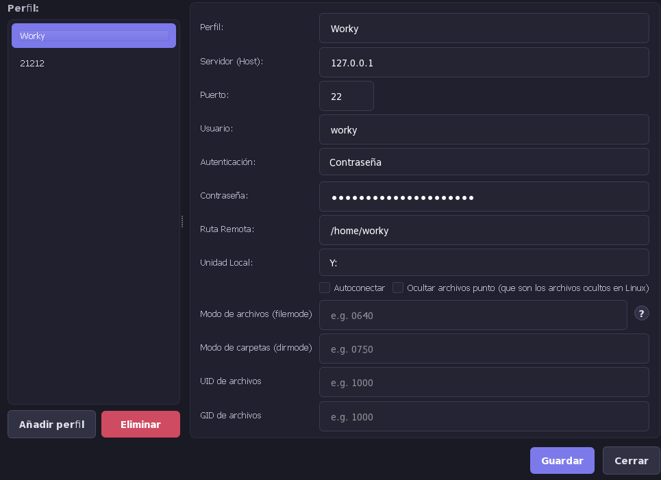
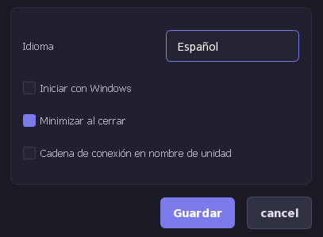

# 🚀 SFTP Mounter

**SFTP Mounter** is a simple, lightweight, and modern Qt6/PySide6 graphical user interface designed to mount SFTP servers as native network drives on **Windows 10/11** using **Rclone** and **WinFsp**.

---

## 📸 Screenshots

| Connection Manager | Profile View | Settings Dialog |
|:---:|:---:|:---:|
|  |  |  |

---

## ✨ Features

*   📦 **All-in-One Standalone Executable:** Compiles into a single `.exe` file with all dependencies embedded (including the portable `rclone` binary).
*   🌐 **Multiple Active Mounts:** Map and mount multiple SFTP connections simultaneously to different Windows drive letters.
*   🔒 **Flexible Authentication:** Supports password authentication, standard SSH private keys, and passphrase-encrypted SSH keys.
*   💾 **Connection Profiles:** Save and quickly load your server configuration history.
*   ⚙️ **System Tray Integration:** Minimize to the system tray, keeping your drives active while running in the background. Right-click the icon to view or open your mounted paths directly in File Explorer.
*   🚀 **Auto-Mount on Startup:** Automatically connect selected profiles on app startup using an asynchronous, non-blocking queue.
*   🛡️ **Windows Registry WinFsp Detection:** Dynamically detects the system's WinFsp driver using multiple fallback strategies (registry key GUIDs, kernel services, environment paths).
*   🌐 **On-the-Fly Language Switch:** Toggle interface language dynamically (English, Spanish, etc.).
*   🔒 **Single-Instance Protection:** Prevents conflicts by allowing only one running instance of the application using file locks.

---

## 🚀 Getting Started for Users

### 1. Prerequisites
Before mounting your first SFTP drive, ensure you have **WinFsp** installed.
*   If WinFsp is missing, SFTP Mounter will show a warning panel with a direct option to download and install it.
*   Alternatively, you can download it from [WinFsp Releases](https://github.com/winfsp/winfsp/releases).

### 2. Running SFTP Mounter
1.  Download the latest standalone executable `SFTPMounter-vX.Y.Z.exe` from the GitHub **Releases** section.
2.  Launch the executable. No installation is required!

### 3. Mounting a Drive
1.  Fill in your server connection details: **Host**, **Port**, **User**, and **Password** (or browse for your **SSH Private Key**).
2.  Choose a **Drive Letter** (e.g., `S:`) and give your connection a friendly **Volume Name**.
3.  Click **Connect & Mount**.
4.  Once connected, your drive will open automatically in Windows File Explorer!

---

## 📂 File & Log Locations (Windows)

All application data is securely stored in your local Windows user profile:

*   **Logs:** `C:\Users\<YourUser>\AppData\Roaming\SFTPMounter\app.log`
*   **Settings & Profiles:** `C:\Users\<YourUser>\AppData\Roaming\SFTPMounter\config.json`
*   **Embedded Binaries:** `C:\Users\<YourUser>\AppData\Roaming\SFTPMounter\bin\` (`rclone.exe`, etc.)

---

## 🛠️ Development & Architecture

If you want to contribute, compile the application yourself, or inspect the project changes, please check the developer guide:

👉 **[gemini.md](file:///home/worky/Proyectos/sftp_mounter/gemini.md)**